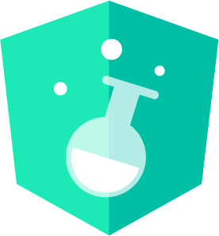

# Introduction

Besides it's creative aspects, programming also involves performing repeating tasks. Some of them can be solved by creating reusable libraries. For the rest, we can leverage code generation. This is what this book is about. It shows how to make use of Schematics, the code generator behind the Angular CLI to generate custom Angular code. Using an example, you will learn how to scaffold a new Schematics project, how to work with templates and how to manipulate existing code.

## Used Version 

The samples shown are using Angular 5.x and the Angular CLI 1.6. If you have troubles with executing the samples make sure that you have installed those versions.

## Angular Labs Project means Changes ahead!

When writing this, Schematics was a Angular Labs Project which means that it is experimental and can change in future. 

{width=25%}

Nether the less, I think it can still be useful to automate repeating tasks even though it means you have to update it from time to time.

## BETA-Book

This book is currently in BETA. This means that there will be updates to respect additional features and erratas or typos. Using Leanpub you can always download the newest version.

## About the Author

Manfred Steyer is a trainer and consultant with focus on Angular. He regularly speaks at conferences and Google recognizes him as a Google Developer Expert (GDE). Furthermore, Manfred wrote for O'Reilly, Microsoft Press, the German Java Magazin and windows.developer.

Since he started with web development in the late 90s, he worked as a team lead in the area of web based software projects tetched at an university of applied sciences. Manfred blogs at [www.softwarearchitekt.at](http://www.softwarearchitekt.at) where you can also lookup the provided (In-House) trainings and consultancy services.

{width=25%}

> Thanks to [Hans Larsen](https://twitter.com/hanslatwork) from the Angular CLI Team for providing valuable feedback 
